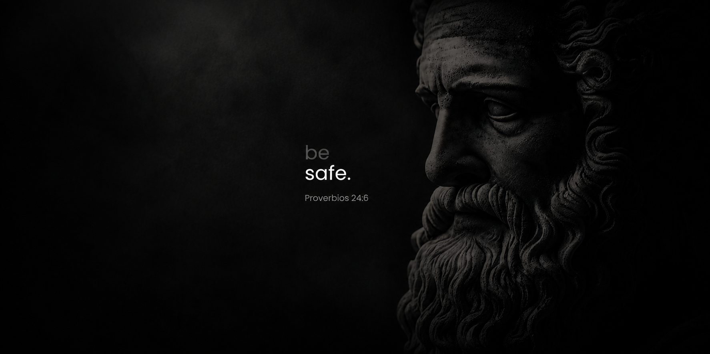

  

# Prazer, Matheus

### Áreas de Atuação

## Sobre

Atuo com Engenharia de Detecção, Cyber Threat Intelligence e Resposta a Incidentes. Atuo no desenvolvimento e melhorias de detecção, monitoramento de inteligência de ameaças e mitigação de riscos.

Atualmente estou me aprofundando em técnicas de Threat Hunting com base no framework MITRE ATT&CK, visando especialização no ramo de Threat Intelligence com foco em ameaças físicas e cibernéticas.

---

### Stack

### Security

---

 

  

