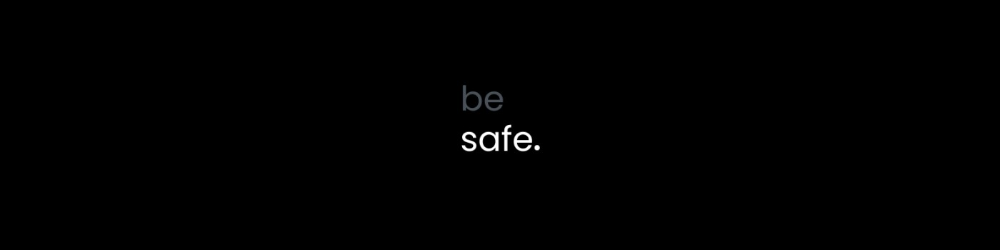

  

# Olá, eu sou o Matheus :)
**Analista de Cibersegurança** | Cyber Threat Intelligence 🦉

# Matheus Santos
**Analista de Cibersegurança** · Engenharia de Detecção · CTI · CSIRT

### Áreas de Atuação

## Sobre

Possuo sólida trajetória em Engenharia de Detecção, Cyber Threat Intelligence e Resposta a Incidentes. Atuo no desenvolvimento e melhorias de detecção, análise e monitoramento de inteligência de ameaças e mitigação de riscos operacionais. Busco constantemente a excelência técnica através de processos organizados e frameworks de segurança, priorizando sempre a proteção de ativos críticos e melhoria contínua da maturidade de segurança do ambiente.

- **Foco de atuação:** Engenharia de detecção, inteligência de ameaças e resposta a incidentes
- **Objetivo:** Colaborar com o fortalecimento e melhoria da maturidade de segurança através do uso de boas práticas de segurança e excelência técnica e operacional
- **Mindset:** Minimalismo operacional e excelência técnica

---

### Linguagens nas quais mais uso

### Ferramentas & Frameworks

| Categoria | Ferramentas |
|-----------|-------------|
| Soluções de Segurança | QRadar, Palo Alto, Zenoss, Wireshark, Snort, Fortigate, FortiAnalyzer, FortiEDR, FortiSIEM, FortiSwitch, Harmony, Azion e Ecotrust.
| Soluções de Monitoramento | Grafana, Datadog, Zabbix
| Frameworks de Segurança | MITRE ATT&CK, NIST, SANS, F3EAD, Admiralty Code e Cyber Kill Chain
| Inteligência de Ameaças Cibernéticas | VirusTotal, AbuseIPDB, Shodan, AbuseCH, Maltego e outros...

---

## Contato

---

## Estatísticas

  

